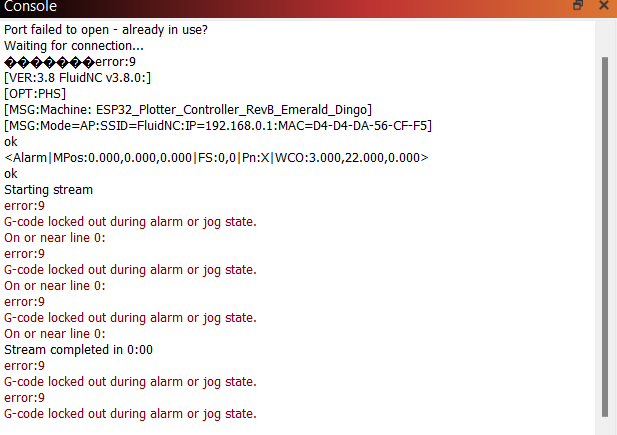

# Connect to terraPen via USB-C

It is possible to control the terraPen using software such as LightBurn over USB-C. This page will outline the steps required.

- Plug in terraPen to a wall outlet
- Plug in USB-C to desktop / laptop
- Check Device Manager for available ports

- Connect to port in Lightburn

- Check serial port for connect and status

- If in alarm state, type $X to remove alarm

- The move commands move the axis incorrectly, and the penup/down does not work correctly

> [!Note]
> The move commands move the axis incorrectly, and the penup/down does not work correctly
> Additional details to connect FLuidNC (the firmware terraPen utilises) with Lightburn [here](<http://wiki.fluidnc.com/en/support/senders/lightburn#:~:text=%C2%B6%20Using%20LightBurn%20(v1.4.0+)%20%C2%B6%20FluidNC%20Config.%20First%20release%20June,>).
