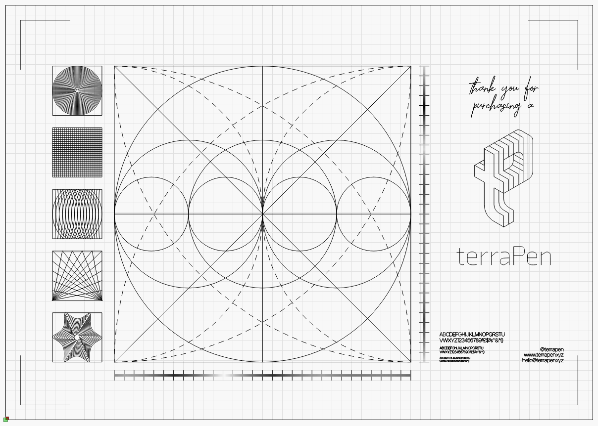
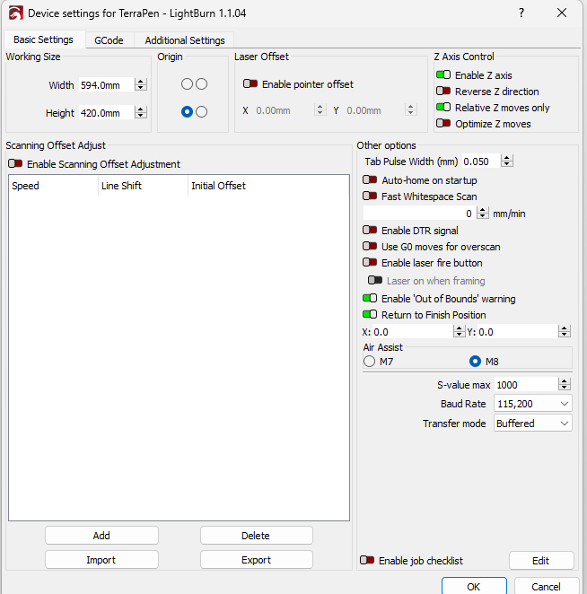
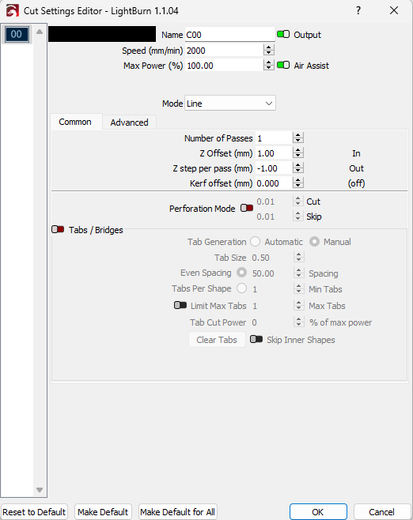
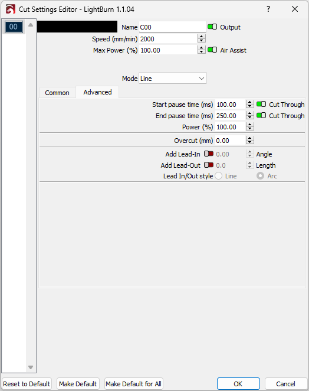
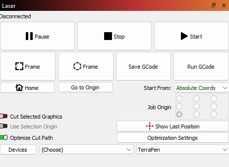

#lightburn settings

Lightburn profiles:

- For terraPen with the pivot arm use Solenoid_Relay_INT_FluidNC.lbprf, download from GitHub [here](https://github.com/theworkisthework/Lightburn-Profiles/blob/main/Solenoid%20Relay%20_INT_%20Fluid%20NC.lbprefs).
- For terraPen without the pivot arm, use Solenoid_Relay_Fluid_NC.lbprefs, download from GitHub [here](https://github.com/theworkisthework/Lightburn-Profiles/blob/main/Solenoid%20Relay%20Fluid%20NC.lbprefs).
- For terraPen with the servo use terraPen_fluidServo.lbprefs, download from GitHub [here](https://github.com/theworkisthework/Lightburn-Profiles/blob/main/terraPen_fluidServo.lbprefs).

|                                                                                               |
|-----------------------------------------------------------------------------------------------|
| General view of the A2 canvas in Lightburn |
|Device settings. Ensure Enable  Z axis and Relative Z moves only are selected |
|Ensure Max Power % is set to 100.  Cut Settings Editor for each layer. For Solenoids, A Z offset of 1mm and -1mm for Z step per pass. For Servo, a Z offset can be as high as 12mm |
|Under the Advanced tab, Enable cut through on both Start pause time and End pause time. Use 100% Power. Start Pause and End time can be set to your preferences, however Start pause time of 100 and End pause time of 250 is recommended. |
|Start From set to Absolute Coords with Job Origin to bottom left button selected. Save the GCode here as a .g filetype  |

!!!Note
	|If you choose to create your own Device / Profile, use GRBL-M3(1.1e or ealier) |
