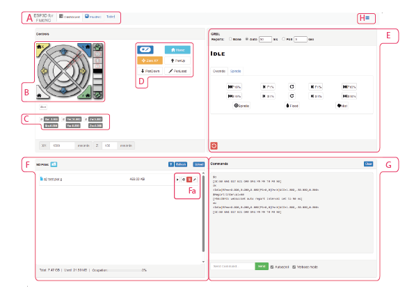

# A
Tabs to navigate home / firmware configuration settings
# B
Jog wheel to move the pen across X, Y and Z axis in increments of 0.1mm, 1mm, 10mm, 100mm
# C
Local and World position of pen carriage
# D
Macros

* ZeroXY - set the zero position to the location of the pen carriage
* Home - will move the tool head back to the 0,0,0 position
* Pen Up - lifts the pen to the up position
* Pen Down - drops the pen to the down position 
# E
Job progress - Select the Auto button and set to 50ms 
# F
* Stored local files - upload gcode files here
* Create new folders to keep projects organised. Navigate into the folder to upload files
* Start a plot by pressing the 'play' icon 
# G
* Serial console - send and receive commands here
# H
* parameters and settings for function of terraPen and the UI